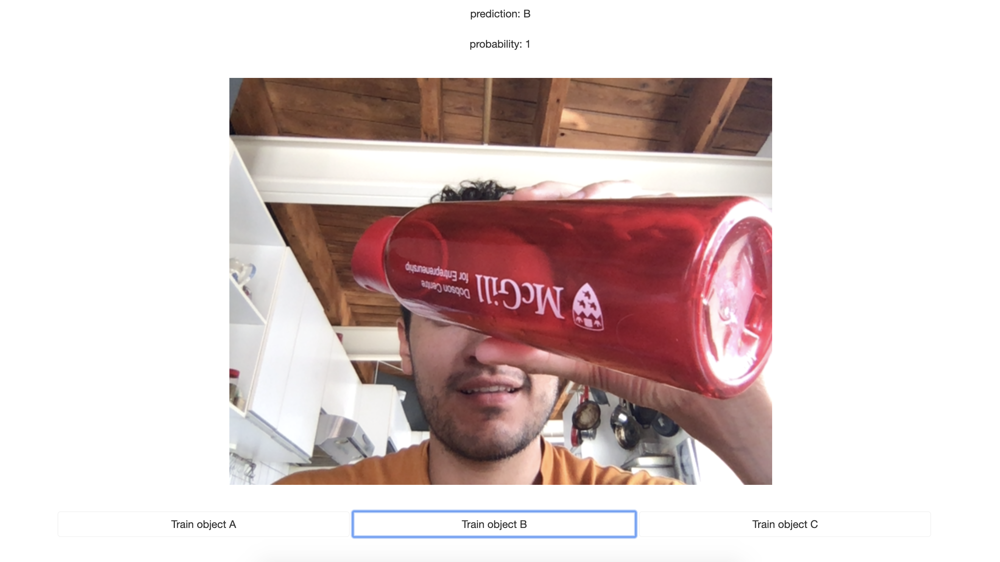

# First Teachable Machine
This is a teachable machine using tensorflow.js to do custom 3-class object classifier using your webcam on the fly.

## Live demo

https://first-teachable-machine.herokuapp.com/

## How it works?

It was train with MobileNet to do image classification in the browser and uses transfer learning, which bootstraps our training with the pre-trained MobileNet model and customizes it to train for your application.

## How to use it?

- Go to https://first-teachable-machine.herokuapp.com/
- OR copy the repository and open index.html in a Web Browser 
- Allow webcam
- Show 3-types of objects for training
- After a few examples your machine will be ready to classify the objects :)

## Screeshots

  Object A 
  
   
  Object B 
  
   
  Object C 
  

  

## You may also like
Another other app I have called "Let The App Guess":
https://github.com/zeajose/let-the-app-guess

